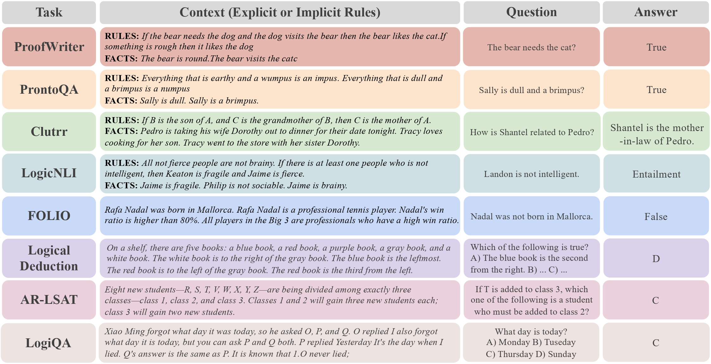

<div id="top">

<!-- HEADER STYLE: CLASSIC -->
<div align="center">

# RuleReasoner: Reinforced Rule-based Reasoning<br>via Domain-aware Dynamic Sampling

<em></em>

<p align="center">
    | <a href="https://github.com/bigai-nlco/RuleReasoner"><b>⚙️ Code</b></a> |
    <a href="https://huggingface.co/RuleReasoner"><b>🤗 Model</b></a> |
    <a href="https://huggingface.co/datasets/RuleReasoner/rule-reasoning"><b>📚 Data</b></a> |<b></b></a>
</p>

<!-- BADGES -->
<!-- local repository, no metadata badges. -->


<br>


<a href="https://github.com/bigai-nlco/RuleReasoner/blob/main/LICENSE">
	
</a>
<a href="https://arxiv.org/abs/2506.08672">
	
</a>


</div>
<br>


## 📍 TL;DR
Reinforced Rule-based Reasoning (RuleReasoner) is a simple yet effective method enabling small reasoning models (SRMs) to effectively learn rule-based reasoning. Unlike large models that need complex training, RuleReasoner uses a curated collection of tasks and a domain-aware dynamic sampling approach, adjusting training based on historical performance. This simple yet effective technique allows SRMs to outperform frontier Large Reasoning Models (LRMs) by +4.1% on in-distribution tasks and +10.4% on out-of-distribution tasks, while also being more computationally efficient.
- Domain-aware dynamic sampling with higher training sampling efficiency and domain performance balance.


- Comprehensive Data curation for data curricula on rule-centric application.


- Rule Reasoner (8B and 4B) depicts comparable performance versus a wide range of baselines.


- Rule Reasoner (8B and 4B) also achives strong OOD performance across three benchmarks (subsets of rule-based reasoning) including BBH, ProverQA, and BBEH.


## 🗺️ Table of Contents

- [TL;DR](#-tldr)
- [Table of Contents](#%EF%B8%8F-table-of-contents)
- [Quick Start](#-quick-start)
    - [Prerequisites](#prerequisites)
    - [Installation](#installation)
    - [Training](#training)
    - [Evaluation](#evaluation)
- [Project Structure](#-project-structure)
- [Contributing](#-contributing)
- [License](#%EF%B8%8F-license)
- [Citation](#-citation)

## 🎯 Quick Start

### Prerequisites

Running `RuleReasoner` requires the following dependencies:

### Installation

Build RuleReasoner from the source and install dependencies:

1. **Clone the repository:**

    ```bash
    ❯ git clone https://github.com/bigai-nlco/RuleReasoner.git
    ```

2. **Navigate to the project directory:**

    ```sh
    ❯ cd RuleReasoner
    ```

3. **Install the dependencies:**

	```bash
	❯ pip install -r requirements.txt
	❯ pip install -e ./verl
	❯ pip install -e .
	```

### Training

Run the training with:

```bash
./scripts/train/train_mix.sh
```

### Evaluation

Run the evaluation with:

```bash
./scripts/eval/eval_model.sh \
    --model $MODEL_PATH \
    --datasets $DATASET_PATH \
    --output-dir $OUTPUT_DIR
```

## 🌳 Project Structure

```bash
└── RuleReasoner
    ├── LICENSE
    ├── README.md
    ├── requirements.txt
    ├── scripts
    │   ├── build_dataset.py
    │   ├── data
    │   ├── eval
    │   └── train
    ├── setup.py
    ├── src
    │   ├── __init__.py
    │   ├── data
    │   ├── globals.py
    │   ├── system_prompts.py
    │   └── utils.py
    └── verl
	└── ...
```

## 🔧 Contributing

- **💬 [Join the Discussions](https://LOCAL/Desktop/RuleReasoner/discussions)**: Share your insights, provide feedback, or ask questions.
- **🐛 [Report Issues](https://LOCAL/Desktop/RuleReasoner/issues)**: Submit bugs found or log feature requests for the `RuleReasoner` project.
- **💡 [Submit Pull Requests](https://LOCAL/Desktop/RuleReasoner/blob/main/CONTRIBUTING.md)**: Review open PRs, and submit your own PRs.

<details closed>
<summary>Contributing Guidelines</summary>

1. **Fork the Repository**: Start by forking the project repository to your local host.
2. **Clone Locally**: Clone the forked repository to your local machine using a git client.
   ```bash
   git clone https://github.com/bigai-nlco/RuleReasoner.git
   ```
3. **Create a New Branch**: Always work on a new branch, giving it a descriptive name.
   ```bash
   git checkout -b new-feature-x
   ```
4. **Make Your Changes**: Develop and test your changes locally.
5. **Commit Your Changes**: Commit with a clear message describing your updates.
   ```sh
   git commit -m 'Implemented new feature x.'
   ```
6. **Push to local**: Push the changes to your forked repository.
   ```sh
   git push origin new-feature-x
   ```
7. **Submit a Pull Request**: Create a PR against the original project repository. Clearly describe the changes and their motivations.
8. **Review**: Once your PR is reviewed and approved, it will be merged into the main branch. Congratulations on your contribution!
</details>

## ©️ License

Rulereasoner is protected under the [LICENSE](https://choosealicense.com/licenses) License. For more details, please refer to the [LICENSE](https://choosealicense.com/licenses/) file.

## 🔖 Citation
```latex
@article{liu2025rulereasoner,
      title={RuleReasoner: Reinforced Rule-based Reasoning via Domain-aware Dynamic Sampling}, 
      author={Yang Liu and Jiaqi Li and Zilong Zheng},
      year={2025},
      eprint={2506.08672},
      archivePrefix={arXiv},
      primaryClass={cs.CL},
      url={https://arxiv.org/abs/2506.08672}, 
}
```
